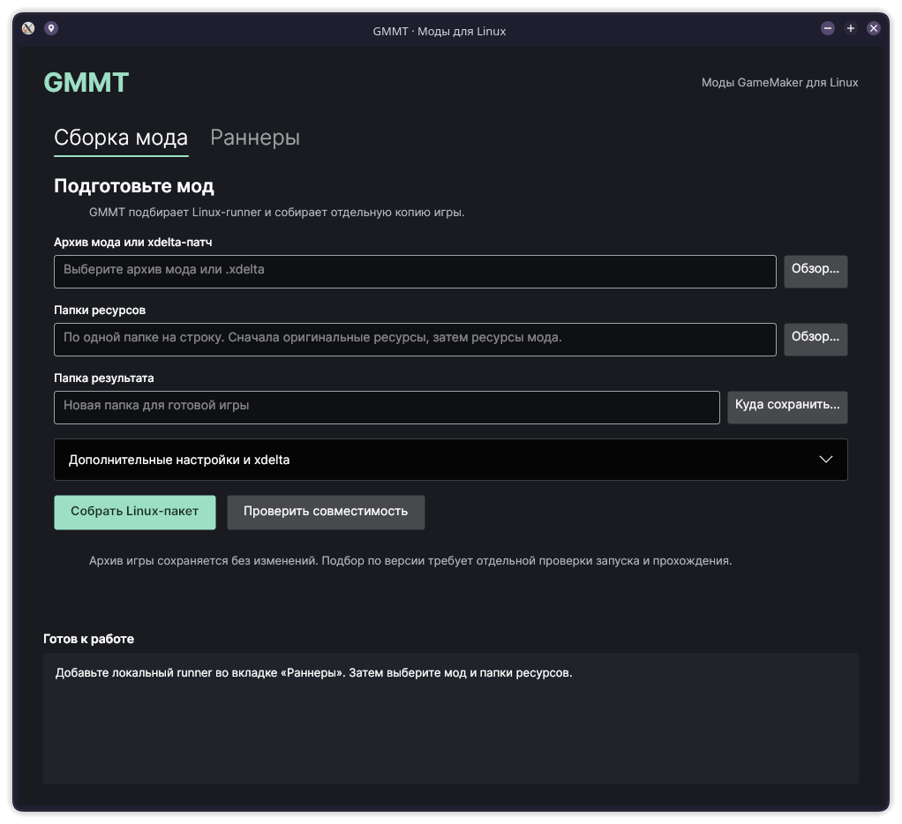

# GMMT

**GMMT собирает отдельную Linux-копию мода для GameMaker с помощью совместимого локального раннера.** Программа читает `data.win` / `game.unx` или восстанавливает архив из xdelta-патча, подбирает Linux-движок из вашего каталога и упаковывает его вместе с ресурсами и скриптом запуска.

Игровой архив переносится побайтно: GMMT не переписывает GML и не понижает версию движка. Это позволяет исследовать запуск Windows-модов под Linux там, где существует подходящий нативный раннер.

> Проект экспериментальный. Совпадение метаданных означает предварительный подбор; работоспособность конкретного мода подтверждается запуском и игровыми тестами.



## Возможности

- Настольный интерфейс на Avalonia: сборка мода, проверка подбора и управление каталогом раннеров.
- CLI для ручных экспериментов и автоматизации.
- Входные архивы `data.win` / `game.unx` и `.xdelta` с чистым **Windows-архивом** нужной версии игры.
- Подбор по версии GameMaker и байткода, проверка ELF-архитектуры и SHA256 раннера.
- Предпочтение раннера, чей эталонный архив полностью совпадает с входным.
- Объединение внешних ресурсов и добавление подготовленных Linux-библиотек.
- Отдельный результат без изменения установленной игры; существующая папка результата не перезаписывается.
- Манифест с контрольными суммами, основанием подбора, предупреждениями и составом файлов.
- Сборки приложения в AppImage, deb, rpm и переносимом tar.zst.

Старый эксперимент с diff/transplant и GMS2 → GMS1 сохранён в [`old/translation`](old/translation/README.md). Он остаётся доступен для дальнейших исследований.

## Системные требования

Готовые пакеты версии **0.2.0** собраны для **Linux x86_64 / amd64** и включают .NET. Устанавливать .NET отдельно для их запуска не требуется.

Нужны обычные системные библиотеки: glibc, libgcc/libstdc++, X11 или XWayland, OpenGL/Mesa, fontconfig/freetype, ICU, OpenSSL 3 и zlib. deb/rpm объявляют зависимости; для AppImage и переносимого архива они должны присутствовать в системе. Alpine/musl и ARM этими сборками не покрываются.

Для применения xdelta-патчей требуется **xdelta3** из пакетного менеджера дистрибутива. При работе с уже готовым архивом он не нужен.

Самому игровому раннеру могут понадобиться отдельные библиотеки, Steam runtime или 32-битные зависимости. Включённый .NET обслуживает GMMT, а не заменяет зависимости игры.

## Установка и запуск

Сборочный скрипт создаёт перечисленные файлы в `dist/`. Готовые пакеты не хранятся в Git; если в репозитории ещё нет опубликованного релиза, их нужно получить у автора или собрать по инструкции ниже.

| Формат | Файл | Применение |
| --- | --- | --- |
| AppImage | `GMMT-0.2.0-x86_64.AppImage` | Запуск без системной установки |
| deb | `gmmt_0.2.0_amd64.deb` | Debian/Ubuntu и совместимые дистрибутивы |
| rpm | `gmmt-0.2.0-1.x86_64.rpm` | Fedora и совместимые RPM-дистрибутивы |
| tar.zst | `gmmt-0.2.0-linux-x86_64.tar.zst` | Переносимая папка, в том числе для Arch/CachyOS |

### AppImage

```sh
chmod +x GMMT-0.2.0-x86_64.AppImage
./GMMT-0.2.0-x86_64.AppImage

# CLI из того же файла
./GMMT-0.2.0-x86_64.AppImage --cli --help
```

Если система не предоставляет FUSE, используйте режим извлечения и запуска:

```sh
./GMMT-0.2.0-x86_64.AppImage --appimage-extract-and-run
./GMMT-0.2.0-x86_64.AppImage --appimage-extract-and-run --cli --help
```

Подробнее: [официальная документация AppImage о FUSE](https://docs.appimage.org/user-guide/troubleshooting/fuse.html).

### deb

```sh
sudo apt install ./gmmt_0.2.0_amd64.deb
# Только если нужны xdelta-патчи:
sudo apt install xdelta3

gmmt
gmmt-cli --help
```

### rpm

```sh
sudo dnf install ./gmmt-0.2.0-1.x86_64.rpm
sudo dnf install xdelta3

gmmt
gmmt-cli --help
```

Пакеты пока не подписаны. deb/rpm устанавливают файлы приложения в `/opt/gmmt`, команды — в `/usr/bin`, а ярлык — в меню приложений. Дистрибутивы могут различаться названиями зависимостей; установка на каждом из них требует отдельной проверки.

### Переносимый архив

```sh
tar --zstd -xf gmmt-0.2.0-linux-x86_64.tar.zst
./GMMT.AppDir/AppRun
./GMMT.AppDir/AppRun --cli --help
```

Архив сохраняет исполняемые разрешения при извлечении на обычную Linux-файловую систему. Для внешних дисков с `noexec` перенесите приложение на диск, где разрешён запуск.

Для проверки скачанных файлов выполните `sha256sum -c SHA256SUMS` в папке с пакетами. `build-info.json` содержит версию SDK, архитектуру, исходный коммит и признак изменений рабочего дерева.

## Быстрый старт в интерфейсе

### 1. Добавьте Linux-runner

Откройте вкладку **«Раннеры»** и укажите:

1. Уникальный ID, например `undertale-linux`.
2. Linux-исполняемый файл раннера в формате ELF.
3. Эталонный `game.unx` / `data.win` игры, которая уже работает с этим раннером.
4. При необходимости — `steam-runtime/run.sh` из локального Steam scout.

Нажмите **«Добавить runner»**. Регистрация читает метаданные и контрольные суммы; она не запускает игру и не сертифицирует совместимость.

Раннер и эталонный архив предоставляете вы. В сборки GMMT не входят игровые движки, игры, моды или сохранения.

### 2. Подготовьте мод

На вкладке **«Сборка мода»** выберите архив мода либо `.xdelta`.

- Для `.xdelta` раскройте **«Дополнительные настройки и xdelta»** и выберите чистый **Windows** `data.win`, рассчитанный именно на этот патч. Linux-архив похожей игры не является заменой.
- Добавьте папки внешних ресурсов: сначала ресурсы оригинала, затем мода. Каждая папка — отдельная строка. Более поздние файлы с тем же относительным путём заменяют более ранние.
- Укажите **новую** папку результата. Кнопка **«Куда сохранить…»** выбирает родительскую папку и предлагает внутри неё `gmmt-linux-package`; путь можно отредактировать.
- Если необходимо, укажите ID раннера и папки Linux-библиотек в дополнительных настройках.

### 3. Проверьте и соберите

**«Проверить совместимость»** анализирует архив и показывает выбранного кандидата, предупреждения и блокировки. Если кандидатов несколько, укажите конкретный ID.

**«Собрать Linux-пакет»** создаёт готовую папку. При обнаружении нативных расширений потребуется вручную подготовить их Linux-зависимости и отметить соответствующий пункт в дополнительных настройках. Эта отметка подтверждает вашу проверку; GMMT не преобразует Windows DLL в Linux SO.

Состояние работы и подробный результат закреплены внизу окна. При ошибке сообщение содержит причину; исходные файлы не заменяются.

### 4. Запустите полученную игру

```sh
cd /path/to/new/linux-package
bash launch.sh
```

Проверьте хотя бы меню, управление, загрузку ресурсов, звук и сохранения. Затем тестируйте характерные сцены и новые механики мода. Успешная сборка пакета сама по себе не означает успешное прохождение.

## Как устроен подбор

Каталог хранит ID, путь и SHA256 раннера, ELF-архитектуру, версию движка/байткода эталонного архива и его SHA256. При подборе GMMT:

1. Отклоняет YYC-архивы и несовместимые версии.
2. Ищет профили с совпадающей версией движка и байткода.
3. Предпочитает профиль с точно совпавшим эталонным архивом.
4. Требует явный ID при неоднозначности.
5. Проверяет наличие, контрольную сумму и архитектуру выбранного ELF, а также доступность указанного Steam runtime.

В манифесте `SameArchiveAsReference` означает совпадение архива с эталоном; `MatchingMetadataOnly` — предварительное совпадение по метаданным. Ни одно из этих значений не является автоматическим игровым тестом.

По умолчанию каталог находится в пользовательской папке локальных данных, обычно `~/.local/share/gmmt/runners.json`. Его можно изменить в интерфейсе, через `--catalog FILE` или переменную `GMMT_CATALOG`.

Пути в каталоге локальные. При переносе на другой компьютер зарегистрируйте раннеры заново или поправьте пути. Каталоги не входят в репозиторий и установочные пакеты.

## CLI

После установки deb/rpm используйте `gmmt-cli`. Для AppImage — `./GMMT-0.2.0-x86_64.AppImage --cli`, для tar.zst — `./GMMT.AppDir/AppRun --cli`. В примерах ниже показан вариант deb/rpm.

```sh
# Прочитать метаданные и хеш архива
gmmt-cli inspect --archive "/path/to/mod/data.win"

# Зарегистрировать локальный раннер
gmmt-cli register-runner \
  --id gms2-local \
  --runner "/path/to/linux/runner" \
  --reference "/path/to/working/reference/game.unx"

# Необязательный аргумент при регистрации:
# --steam-runtime "/path/to/steam-runtime/run.sh"

gmmt-cli runners

gmmt-cli plan --archive "/path/to/mod/data.win"
# Явный выбор при нескольких кандидатах:
gmmt-cli plan --archive "/path/to/mod/data.win" --runner-id gms2-local

# Собрать из готового архива
gmmt-cli package \
  --archive "/path/to/mod/data.win" \
  --assets "/path/to/original/assets" \
  --assets "/path/to/mod/assets" \
  --output "/path/to/new/linux-package"

# Собрать из патча
gmmt-cli package \
  --patch "/path/to/mod.xdelta" \
  --vanilla "/path/to/clean/windows/data.win" \
  --assets "/path/to/original/assets" \
  --assets "/path/to/mod/assets" \
  --output "/path/to/new/linux-package"

# При необходимости добавьте:
# --runner-id gms2-local
# --libraries "/path/to/prepared/linux/libraries"
# --native-extensions-reviewed
# --catalog "/path/to/runners.json"

gmmt-cli --help
```

Команды возвращают JSON, сообщения об ошибках идут в stderr. Коды завершения: `0` — успех; `1` — ошибка входных данных/выполнения; `2` — подбор или упаковка заблокированы.

## Что находится в игровом пакете

```text
linux-package/
├── runner                  # Выбранный Linux ELF
├── assets/
│   ├── game.unx            # Исходный архив без изменений
│   └── …                   # Внешние ресурсы
├── lib/                    # Необязательные локальные библиотеки
├── launch.sh               # Скрипт запуска
└── gmmt-package.json       # Метаданные, предупреждения, контрольные суммы
```

Windows-установщики, скрипты, патчи и лишние основные архивы не копируются как ресурсы. Деревья с символическими ссылками отклоняются. Пакет сначала собирается во временной соседней папке и становится результатом только после проверки контрольных сумм архива и раннера.

`GameplayVerified` остаётся `false`: программа не выполняет игровые тесты автоматически. Если выбран Steam runtime, он остаётся внешней локальной зависимостью; на другом компьютере его путь можно переопределить через `GMMT_STEAM_RUNTIME`.

## Проверенные случаи и ограничения

| Случай | Что проверено | Чего проверка не доказывает |
| --- | --- | --- |
| Undertale Together, Windows-архив + оригинальный Linux-runner GMS1 | Сборка и запуск через сгенерированный launcher | Прохождение всех кооперативных сцен |
| Undertale Red & Yellow, архив из Windows-патча + Linux-runner официального порта GMS2 | Сборка и запуск; отдельно проверены старт/ввод на официальном контроле | Универсальную поддержку GMS2-модов без Linux-порта |
| Пакеты GMMT 0.2.0 | Проверка файлов и автономного CLI; запуск интерфейса на CachyOS | Установку и работу на всех Debian/Fedora-подобных системах |

У UTRY существует Linux-порт; у Together доступны инструкции для Linux. Эти случаи полезны как контрольные примеры, но не заменяют тест отдельного Windows-мода без готового порта.

Не реализованы:

- Универсальное преобразование GMS2 → GMS1.
- Автоматическая загрузка и раздача раннеров.
- Преобразование Windows DLL, YYC-кода или специфичных Windows API.
- Автоматическая подготовка всех внешних ресурсов и библиотек.
- Автоматическое доказательство игровой совместимости.

Даже похожие игры могут требовать разные раннеры. Несовпадение семантики, расширений и платформенных функций нужно диагностировать на конкретном моде.

## Решение частых проблем

| Симптом | Что проверить |
| --- | --- |
| Runner не найден | Есть ли профиль для версии движка и байткода именно этого архива |
| Несколько кандидатов | Укажите ID в дополнительных настройках или `--runner-id` |
| Runner изменился после регистрации | Проверьте файл и зарегистрируйте его под новым ID |
| xdelta завершается ошибкой | Установлен ли xdelta3; совпадает ли чистый Windows-архив с версией, ожидаемой патчем |
| Папка результата уже существует | Выберите новый путь; GMMT не перезаписывает существующую папку |
| Обнаружены native extensions | Подготовьте Linux-эквиваленты и библиотеки; отметка проверки не устраняет несовместимость |
| AppImage не запускается из-за FUSE | Используйте `--appimage-extract-and-run` |
| Игра не видит звук/медиа | Проверьте папки ресурсов и порядок их объединения |
| Игра требует библиотеку/32-bit runtime | Проверьте зависимости самого раннера; добавьте совместимые библиотеки или Steam runtime |

Подробности экспериментов, контрольные суммы и известные особенности среды находятся в [журнале разработки и тестов](docs/testing/2026-10-04-undertale-handoff.md).

## Сборка из исходников

Нужны Git и **.NET 10 SDK**. Репозиторий использует закреплённые Git-подмодули UndertaleModTool и Underanalyzer.

```sh
git clone --recurse-submodules https://github.com/AndrewImm-OP/gmmt.git
cd gmmt
bash setup.sh

dotnet src/Gmmt.Desktop/bin/Debug/net10.0/gmmt-desktop.dll
dotnet src/Gmmt.Cli/bin/Debug/net10.0/gmmt.dll --help
```

Репозиторий пока приватный: клонирование требует доступа. `setup.sh` инициализирует подмодули, применяет совместимые патчи целевых framework и собирает решение. В upstream-коде пока остаются предупреждения nullable/Fody.

### Сборка установочных пакетов

Помимо SDK нужны Python 3.11+, `dpkg-deb`, `rpmbuild`, `tar`, `zstd` и [appimagetool](https://github.com/AppImage/appimagetool). Скрипт выполняет self-contained publish интерфейса и CLI для `linux-x64`, затем собирает все четыре формата без root.

```sh
python3 scripts/build-linux.py --version 0.2.0

# Собственный путь к инструменту или AppImage runtime для офлайн-упаковки:
python3 scripts/build-linux.py \
  --version 0.2.0 \
  --appimagetool /path/to/appimagetool \
  --runtime-file /path/to/runtime-x86_64 \
  --output ./dist
```

Первой сборке нужен сетевой доступ к NuGet и, если не задан `--runtime-file`, к источнику runtime AppImage. Скрипт хранит HTTP-кэш и staging в `/tmp`, чтобы сборка работала и с checkout на exFAT. Подробности состава пакетов и их проверки: [docs/packaging.md](docs/packaging.md).

### Проверки

```sh
dotnet build tests/Gmmt.Runtime.Tests/Gmmt.Runtime.Tests.csproj -m:1
dotnet run --project tests/Gmmt.Runtime.Tests --no-build
```

Тесты покрывают выбор и неоднозначность раннеров, несовпадения версий, изменение файлов, подтверждение native extensions, сохранность архива, существующие папки, атомарный отказ и символические ссылки. Реальные игровые тесты ведутся отдельно, на локальных копиях файлов.

## Структура проекта

```text
src/Gmmt.Desktop/       Avalonia-интерфейс
src/Gmmt.Cli/           Командная строка
src/Gmmt.Runtime/       Каталог, выбор раннера, xdelta и упаковка
src/Gmmt.Core/          Чтение архива и метаданных
extern/                Закреплённые сторонние подмодули
patches/               Патчи сборки зависимостей
packaging/             Значок и desktop entry
scripts/               Сборка дистрибутивных пакетов
tests/                 Проверки runtime/упаковки
old/translation/       Предыдущий конвертер
docs/testing/          Подробный журнал и передача проекта
```

В `experiments/` локально хранятся входные файлы, логи и результаты экспериментов; `dist/` содержит готовые пакеты. Обе папки исключены из Git.

## Дальнейшее развитие

- Проверить Windows-мод без готового Linux-порта.
- Протестировать пакеты в чистых Debian/Ubuntu и Fedora.
- Расширять каталог измеренной совместимости с указанием точных версий и сценариев проверки.
- Улучшить диагностику отсутствующих ресурсов и нативных расширений.
- Исследовать старый конвертер отдельно, сохраняя текущий путь с нативными раннерами.

## Лицензии и файлы игр

Отдельная лицензия исходников GMMT пока не выбрана. UndertaleModTool использует GPLv3, Underanalyzer — MPL 2.0; остальные зависимости сохраняют свои лицензии. Пакеты содержат тексты доступных сторонних лицензий в `licenses/` и `THIRD-PARTY-NOTICES.txt`.

Игры, моды, сохранения и раннеры не входят в репозиторий и сборки приложения. Регистрация локального раннера не предоставляет права распространять игровые или модифицированные файлы.
