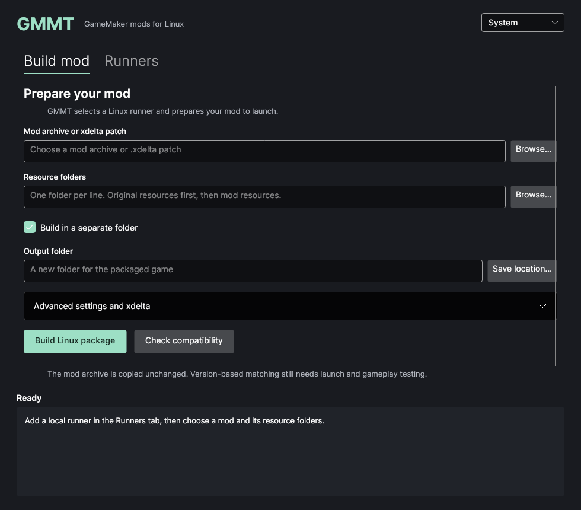

# GMMT

**English** · [Русский](README.ru.md)

**GMMT builds native Linux packages for GameMaker mods using compatible runners from your local games.** Save a package in its own folder or install it into a native Steam game with a backup and restoration. GMMT reads `data.win` / `game.unx`, or reconstructs an archive from an xdelta patch, selects a Linux runner from your catalog, and packages the archive with resources and a launcher.

The mod archive is copied byte for byte. GMMT does not rewrite GML or downgrade the game engine. It explores running Windows-origin mod data on Linux where a suitable native runner exists.

> This is an experimental project. Matching metadata identifies candidates; compatibility with a particular mod still needs launch and gameplay testing.



## Features

- Avalonia desktop interface for packaging, compatibility planning and runner registration.
- Automatic discovery of Steam libraries, native game folders and local runners, including libraries on other drives and Flatpak Steam.
- English and Russian UI, system-language detection and a persistent language selector.
- CLI for experiments and automation.
- `data.win` / `game.unx` input, or `.xdelta` with the exact clean **Windows archive** required by the patch.
- Runner selection using GameMaker/bytecode metadata, ELF architecture and SHA256 checks.
- Preference for runners whose reference archive exactly matches the input.
- Resource overlays and manually prepared Linux libraries.
- Separate output folders, or reversible installation into a native Linux Steam game.
- Output manifests recording hashes, selection evidence, warnings and packaged files.
- AppImage, deb, rpm and portable tar.zst application builds.

The earlier diff/transplant and GMS2 → GMS1 experiment is preserved in [`old/translation`](old/translation/README.md) for further research.

## Downloads and requirements

Download application packages from [GitHub Releases](https://github.com/AndrewImm-OP/gmmt/releases/latest). Version **0.2.2** targets **Linux x86_64 / amd64** and includes .NET; installing .NET separately is not required.

Standard OS libraries are still needed: glibc, libgcc/libstdc++, X11 or XWayland, OpenGL/Mesa, fontconfig/freetype, ICU, OpenSSL 3 and zlib. deb/rpm declare dependencies. AppImage and tar.zst rely on these libraries being present. These builds do not cover ARM or Alpine/musl.

**xdelta3** from your distribution is needed for patch input. Prepared archives do not require it. A selected game runner may need additional libraries, Steam runtime or 32-bit dependencies; GMMT's included .NET runtime does not supply the game's dependencies.

| Format | Download | Use |
| --- | --- | --- |
| AppImage | [GMMT-0.2.2-x86_64.AppImage](https://github.com/AndrewImm-OP/gmmt/releases/download/v0.2.2/GMMT-0.2.2-x86_64.AppImage) | Run without system installation |
| deb | [gmmt_0.2.2_amd64.deb](https://github.com/AndrewImm-OP/gmmt/releases/download/v0.2.2/gmmt_0.2.2_amd64.deb) | Debian/Ubuntu and compatible distributions |
| rpm | [gmmt-0.2.2-1.x86_64.rpm](https://github.com/AndrewImm-OP/gmmt/releases/download/v0.2.2/gmmt-0.2.2-1.x86_64.rpm) | Fedora and compatible RPM distributions |
| tar.zst | [gmmt-0.2.2-linux-x86_64.tar.zst](https://github.com/AndrewImm-OP/gmmt/releases/download/v0.2.2/gmmt-0.2.2-linux-x86_64.tar.zst) | Portable folder, including Arch/CachyOS |

### AppImage

```sh
chmod +x GMMT-0.2.2-x86_64.AppImage
./GMMT-0.2.2-x86_64.AppImage

# CLI from the same file
./GMMT-0.2.2-x86_64.AppImage --cli --help
```

If FUSE is unavailable, use extract-and-run:

```sh
./GMMT-0.2.2-x86_64.AppImage --appimage-extract-and-run
./GMMT-0.2.2-x86_64.AppImage --appimage-extract-and-run --cli --help
```

See the [official AppImage FUSE documentation](https://docs.appimage.org/user-guide/troubleshooting/fuse.html).

### deb

```sh
sudo apt install ./gmmt_0.2.2_amd64.deb
# Only needed for xdelta input:
sudo apt install xdelta3

gmmt
gmmt-cli --help
```

### rpm

```sh
sudo dnf install ./gmmt-0.2.2-1.x86_64.rpm
sudo dnf install xdelta3

gmmt
gmmt-cli --help
```

Packages are currently unsigned. deb/rpm install the payload under `/opt/gmmt`, commands in `/usr/bin` and an application-menu entry. Dependency names differ between distributions; actual installation must be verified on each target distribution.

### Portable archive

```sh
tar --zstd -xf gmmt-0.2.2-linux-x86_64.tar.zst
./GMMT.AppDir/AppRun
./GMMT.AppDir/AppRun --cli --help
```

Extract onto a Linux filesystem that allows executable files. If an external drive is mounted with `noexec`, move the application to an executable filesystem.

Download `SHA256SUMS` alongside the packages and run `sha256sum -c SHA256SUMS`. `build-info.json` records the SDK version, architecture, source commit and dirty-worktree flag. Application builds contain no game archives, mods, saves or runners.

## Interface language

On first launch, the UI follows the system language: Russian for a Russian locale, English otherwise. The selector in the top-right corner offers **System / English / Русский**. Switching applies immediately without resetting entered paths, the installation mode, selected tab or results.

The preference is stored in the user's local application data directory, normally `~/.local/share/gmmt/settings.json`. Set `GMMT_SETTINGS` to use a separate settings file. **System** restores automatic detection; an explicit choice takes precedence on subsequent launches.

CLI output, machine-readable manifest fields and low-level third-party/OS diagnostics remain in English. Native file dialogs also follow platform behavior. English is the repository's primary language; [README.ru.md](README.ru.md) provides the Russian user guide. See [the localization guide](docs/localization.md) to maintain translations.

## Desktop quick start

### 1. Find and register a Linux runner

On opening, GMMT searches standard and Flatpak Steam locations and libraries listed in `libraryfolders.vdf`. Detected native games appear in the game-folder selector; **Linux ELF + archive** candidates appear in the **Runners** tab. Selecting a candidate fills its runner, reference archive and available Steam scout paths.

`~/Downloads` and `~/Загрузки` are also searched. For extracted Linux mods elsewhere, open **Additional search folders**, add folders and select **Search for runners again**. Search depth and directory counts are bounded; ZIP files are not extracted automatically.

Discovery does not prove the pair works: an installed `game.unx` may already be modified. Confirm that the reference runs with the candidate, then select **Add runner**. Discovery does not automatically register profiles or change game files. Manually supplied files remain supported.

A profile needs:

1. A unique ID, for example `undertale-linux`.
2. A native Linux ELF runner.
3. A reference `game.unx` / `data.win` known to work with that runner.
4. Optionally, a local Steam scout `steam-runtime/run.sh`.

Registration records metadata and hashes. It does not execute or certify the runner. You supply the runner and reference; the application does not download game engines.

### 2. Prepare a mod

In **Build mod**, choose a prepared archive or `.xdelta` patch.

- For xdelta, open **Advanced settings and xdelta** and select the clean **Windows** `data.win` expected by that patch. A Linux archive from a similar game is not a substitute.
- Add external resource folders, one per line: original resources first, mod resources afterward. Later files replace earlier files at the same relative path.
- Keep **Build in a separate folder** checked and choose a **new** output folder. **Save location…** selects a parent and proposes `gmmt-linux-package` inside it; you can edit the path.
- Supply a runner ID or Linux library folders in advanced settings when necessary.

### 3. Check and package

**Check compatibility** reports the candidate, warnings and blockers. If multiple candidates remain, select an explicit runner ID.

**Build Linux package** creates the output. When native extensions are detected, prepare their Linux counterparts/libraries and acknowledge the review in advanced settings. That acknowledgement records your review; GMMT does not convert Windows DLLs into Linux SOs.

Status and details remain pinned below the scrollable form. Work happens off the UI thread. Existing output folders are never overwritten.

### 4. Launch the generated game

```sh
cd /path/to/new/linux-package
bash launch.sh
```

Check the menu, controls, resource loading, sound and saves, then exercise the mod's characteristic scenes and mechanics. A completed package is not a completed gameplay test.

## Install into a Steam game

**Build in a separate folder** is checked by default. Uncheck it to show the detected-game selector, a game-folder picker and restoration action. The primary action becomes **Install mod into Steam**.

1. Close the game. Find its installed folder through Steam's properties → Installed Files → Browse, or choose a detected game.
2. Use a native Linux installation containing `runner`, `assets/game.unx` and `run.sh`. Windows/Proton replacement is not supported.
3. Choose a mod and compatible runner. Installed assets and `lib` folders are prepended automatically; your selected overlays are applied afterward.
4. Select **Install mod into Steam**. GMMT prepares/verifies a package, backs up managed originals under `.gmmt-original` and installs the mod.
5. A standard Steam launch through `run.sh` uses the mod launcher. Remove custom launch options that bypass this script. Testing the actual Steam Play button remains a separate verification task.

The backup preserves the **pre-install state**, which can already contain another modification; it is not certified vanilla Steam data. Another installation is blocked until restoration to protect the original backup.

Close the game and select **Restore pre-install game files** to undo installation. GMMT restores original contents/permissions and removes added managed files. If installed files or the backup changed, ordinary restoration stops and retains the backup. Do not delete `.gmmt-original` to bypass a failure. The journal supports resuming interrupted transitions; damaged backups require manual diagnosis.

Steam updates or integrity verification can replace mod files. Restore with GMMT before those operations. Saves outside the game directory are not modified.

CLI installation/restoration of a prepared package:

```sh
gmmt-cli install --package "/path/to/linux-package" --game-dir "/path/to/Steam/steamapps/common/Undertale"
gmmt-cli restore --game-dir "/path/to/Steam/steamapps/common/Undertale"
```

## How runner selection works

Profiles contain the runner ID, path, SHA256, ELF architecture, reference engine/bytecode metadata and reference SHA256. Selection:

1. Rejects YYC archives and incompatible versions.
2. Matches the archive's engine and bytecode metadata.
3. Prefers a profile with an identical reference archive.
4. Requires an explicit ID when candidates are ambiguous.
5. Checks the selected runner's existence, hash and architecture, plus the optional Steam runtime path.

`SameArchiveAsReference` means an exact reference checksum match. `MatchingMetadataOnly` means an inferred match. Neither represents an automatic gameplay test.

The default catalog is in the user's local data directory, normally `~/.local/share/gmmt/runners.json`. Change it in the desktop, with `--catalog FILE`, or through `GMMT_CATALOG`. Catalog paths are local: register runners again or correct paths on another machine. Catalogs are excluded from source and application builds.

## CLI

With deb/rpm, use `gmmt-cli`. For AppImage, use `./GMMT-0.2.2-x86_64.AppImage --cli`; for tar.zst, use `./GMMT.AppDir/AppRun --cli`. Examples use installed deb/rpm commands.

```sh
# Read-only discovery
gmmt-cli discover
gmmt-cli discover --steam-root "/path/to/Steam" --runner-root "/path/to/extracted/linux-mod"

# Inspect archive metadata and hash
gmmt-cli inspect --archive "/path/to/mod/data.win"

# Register a local runner
gmmt-cli register-runner \
  --id gms2-local \
  --runner "/path/to/linux/runner" \
  --reference "/path/to/working/reference/game.unx"
# Optional: --steam-runtime "/path/to/steam-runtime/run.sh"

gmmt-cli runners
gmmt-cli plan --archive "/path/to/mod/data.win"
gmmt-cli plan --archive "/path/to/mod/data.win" --runner-id gms2-local

# Prepared archive
gmmt-cli package \
  --archive "/path/to/mod/data.win" \
  --assets "/path/to/original/assets" \
  --assets "/path/to/mod/assets" \
  --output "/path/to/new/linux-package"

# Patch input
gmmt-cli package \
  --patch "/path/to/mod.xdelta" \
  --vanilla "/path/to/clean/windows/data.win" \
  --assets "/path/to/original/assets" \
  --assets "/path/to/mod/assets" \
  --output "/path/to/new/linux-package"

# Optional package flags:
# --runner-id gms2-local
# --libraries "/path/to/prepared/linux/libraries"
# --native-extensions-reviewed
# --catalog "/path/to/runners.json"

gmmt-cli --help
```

Commands return JSON; errors go to stderr. Exit codes: `0` success, `1` input/execution error, `2` blocked selection or packaging.

## Generated game package

```text
linux-package/
├── runner                  # Selected Linux ELF
├── assets/
│   ├── game.unx            # Unchanged input archive
│   └── …                   # External resources
├── lib/                    # Optional prepared libraries
├── launch.sh               # Launcher
└── gmmt-package.json       # Metadata, warnings and hashes
```

Windows installers, scripts, patches and redundant main archives are excluded from assets. Symlinked resource trees are rejected. A package is assembled in a temporary sibling directory and published after the archive/runner checksums match.

`GameplayVerified` stays `false`: GMMT does not perform automatic gameplay tests. An optional registered Steam runtime remains an external dependency; override its path on another machine with `GMMT_STEAM_RUNTIME`.

## Evidence and limitations

| Case | Verified evidence | Not established |
| --- | --- | --- |
| Undertale Together Windows archive + original GMS1 Linux runner | Package construction and launcher startup | All cooperative scenes/gameplay |
| Undertale Red & Yellow Windows-patch archive + official GMS2 Linux donor | Construction/startup; control package also tested for initial input | General GMS2 mods without a Linux port |
| Reversible Steam replacement | Real Together package installed into a copy of Undertale, run.sh startup, SHA256-complete restoration | Clicking Play in the real Steam client |
| Application distribution packages | Extracted payloads, standalone CLI, native dependencies and GUI smoke checks on CachyOS | Installation on every Debian/Fedora-like distribution |

UTRY has a Linux port; Together has Linux instructions. They are useful controls, not a replacement for testing a Windows-only mod with no existing Linux port.

Not implemented:

- Universal GMS2 → GMS1 translation.
- Runner downloads or redistribution.
- Windows DLL, YYC or platform-specific API conversion.
- Fully automatic preparation of external resources and native dependencies.
- Automatic proof of gameplay compatibility.

Similar games can still require different runners. Engine semantics, extensions and platform functions must be assessed for each mod.

## Troubleshooting

| Symptom | Check |
| --- | --- |
| No runner found | Register a profile matching this archive's engine/bytecode metadata |
| Multiple candidates | Specify an ID in advanced settings or `--runner-id` |
| Runner changed | Verify the binary and register it under a new ID |
| xdelta fails | Install xdelta3 and use the exact clean Windows baseline expected by the patch |
| Output exists | Choose a new folder; GMMT does not overwrite standalone outputs |
| Native extensions detected | Prepare Linux replacements/libraries; the acknowledgement does not fix incompatibility |
| AppImage FUSE failure | Use `--appimage-extract-and-run` |
| Missing media | Check resource folders and overlay order |
| Runner needs libraries/32-bit support | Supply compatible dependencies or a suitable Steam runtime |
| Steam backup already exists | Restore it before another installation |
| Restoration refuses changed files | Preserve the backup and inspect the journal/hashes; do not force deletion |

The [development/testing journal](docs/testing/2026-10-04-undertale-handoff.md) records exact experiments, input hashes, commands and remaining verification work.

## Build from source

Requirements: Git and **.NET 10 SDK**. UndertaleModTool and Underanalyzer are pinned Git submodules.

```sh
git clone --recurse-submodules https://github.com/AndrewImm-OP/gmmt.git
cd gmmt
bash setup.sh

dotnet src/Gmmt.Desktop/bin/Debug/net10.0/gmmt-desktop.dll
dotnet src/Gmmt.Cli/bin/Debug/net10.0/gmmt.dll --help
```

`setup.sh` initializes submodules, applies framework-compatibility patches and builds the solution. Upstream nullable/Fody warnings currently remain.

### Build distribution packages

Install Python 3.11+, `dpkg-deb`, `rpmbuild`, `tar`, `zstd` and [appimagetool](https://github.com/AppImage/appimagetool) in addition to the SDK. The script publishes self-contained desktop/CLI applications for `linux-x64` and builds all four formats without root.

```sh
python3 scripts/build-linux.py --version 0.2.2

# Custom appimagetool or an existing runtime for offline AppImage packaging:
python3 scripts/build-linux.py \
  --version 0.2.2 \
  --appimagetool /path/to/appimagetool \
  --runtime-file /path/to/runtime-x86_64 \
  --output ./dist
```

Initial publication needs NuGet access and, without `--runtime-file`, an AppImage runtime download. HTTP cache and staging live in `/tmp` to support checkouts on exFAT. See [the packaging guide](docs/packaging.md) for layout, dependencies and artifact verification.

### Tests

```sh
dotnet build tests/Gmmt.Runtime.Tests/Gmmt.Runtime.Tests.csproj -m:1
dotnet run --project tests/Gmmt.Runtime.Tests --no-build
python3 scripts/verify-linux.py --version 0.2.2
```

Tests cover selection/mismatches, ambiguity, file mutations, extension acknowledgement, archive preservation, atomic failures, symlinks, reversible installation, backup integrity, interrupted restoration, discovery and localization/settings. Real game tests use isolated local copies and separate save overlays.

## Repository layout

```text
src/Gmmt.Desktop/       Avalonia UI and English/Russian localization catalogs
src/Gmmt.Cli/           Command-line interface
src/Gmmt.Runtime/       Discovery, catalogs, selection, xdelta and installation
src/Gmmt.Core/          Archive loading and metadata
extern/                Pinned third-party submodules
patches/               Dependency build patches
packaging/             Icon and desktop entry
scripts/               Distribution builds and test harnesses
tests/                 Runtime, packaging, discovery and localization checks
old/translation/       Preserved earlier converter
docs/testing/          Detailed development journal and agent handoff
```

`experiments/` contains local inputs/logs/results; `dist/` contains application artifacts. Both are ignored by Git. English documentation is primary; historical converter source remains preserved.

## Further work

- Test a Windows-only mod without an existing native port.
- Test installation/uninstallation on clean Debian/Ubuntu and Fedora.
- Record measured runner/archive associations with exact versions and gameplay scenarios.
- Improve diagnosis of missing resources and native extensions.
- Continue research on the earlier converter separately from the native-runner path.

## Licenses and game files

GMMT has no separately assigned source license yet. UndertaleModTool uses GPLv3, Underanalyzer MPL 2.0; other dependencies retain their licenses. Available dependency texts ship under `licenses/` and `THIRD-PARTY-NOTICES.txt`.

Games, mods, saves and runners are not included in this repository or application builds. Registering a local runner does not grant redistribution rights to game, engine or mod assets.
